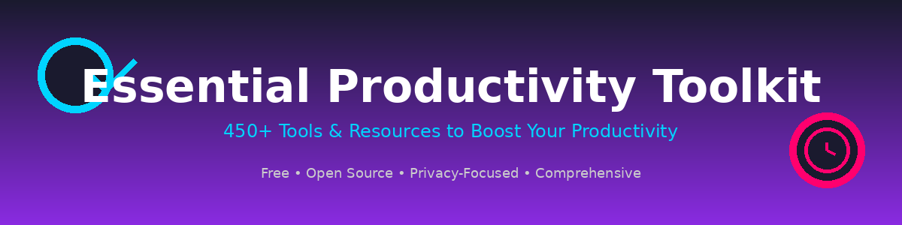

# 🚀 Essential Productivity Toolkit

### The Ultimate Collection of 650+ Productivity Tools, Apps, Methods & Resources

**Free • Open Source • Privacy-Focused • Comprehensive**

[🔗 View All Resources](RESOURCES.md) • [💬 Discussions](https://github.com/techcompare/Essential-Productivity-Toolkit/discussions) • [🤝 Contribute](contributing.md) • [⭐ Star this repo](#)

---

## 📖 About This Collection

**The Essential Productivity Toolkit** is the most comprehensive, curated collection of productivity resources on GitHub. Whether you're a **student, professional, developer, entrepreneur, or lifelong learner**, you'll find tools here to supercharge your workflow.

### ✨ What Makes This Special?

- 🎯 **650+ Carefully Curated Resources** - Quality over quantity
- 🆓 **Free & Open Source Focus** - Accessible to everyone  
- 🔒 **Privacy-Respecting Tools** - Your data, your control
- 🤖 **AI-Powered Productivity** - Latest AI tools and assistants
- 🌐 **Constantly Updated** - Fresh tools added regularly
- 📱 **Cross-Platform** - Windows, Mac, Linux, Web, iOS, Android
- 🔗 **FMHY-Inspired** - Comprehensive, organized, community-driven

### 🎓 Perfect For

- **Students** - Study tools, note-taking, time management
- **Developers** - Coding tools, IDEs, automation, APIs
- **Content Creators** - Video, audio, design, and media tools
- **Remote Workers** - Collaboration, communication, productivity
- **Entrepreneurs** - Business tools, automation, finance
- **Privacy Advocates** - Secure, encrypted, open-source alternatives

---

## 📑 Table of Contents

<b>🎯 Core Productivity (Click to expand)</b>

- [📋 Planning & Organization](#-planning--organization)
- [🎯 Focus & Deep Work](#-focus--deep-work)
- [⏱️ Time & Energy Management](#️-time--energy-management)
- [📐 Productivity Methods & Frameworks](#-productivity-methods--frameworks)
- [🔄 Habits & Behavior Change](#-habits--behavior-change)
- [🎯 Goals & Achievement](#-goals--achievement)

<b>💼 Work & Collaboration (Click to expand)</b>

- [💼 Work & Career](#-work--career)
- [💬 Communication & Collaboration](#-communication--collaboration)
- [📅 Meetings & Scheduling](#-meetings--scheduling)
- [📧 Email Management](#-email-management)
- [🏠 Remote Work](#-remote-work)
- [👥 Leadership & Team Management](#-leadership--team-management)

<b>🧠 Knowledge & Learning (Click to expand)</b>

- [📚 Learning & Personal Growth](#-learning--personal-growth)
- [📝 Note-Taking Systems](#-note-taking-systems)
- [🧠 Knowledge Management](#-knowledge-management)
- [🔍 Reading & Research](#-reading--research)
- [✍️ Writing & Content Creation](#️-writing--content-creation)

<b>💻 Technology & Tools (Click to expand)</b>

- [🛠️ Tools & Apps](tools.md)
- [🤖 Automation & Workflows](automation.md)
- [👨‍💻 Development & Coding](development.md)
- [🌐 Browser Extensions & Web Tools](browser.md)
- [🔐 Security & Privacy](security.md)

<b>🆕 Enhanced Categories (NEW!) (Click to expand)</b>

- [🤖 **AI Productivity Tools**](ai-productivity.md) - AI assistants, writing, coding, automation
- [🔒 **Privacy & Ad-Blocking**](privacy-tools.md) - Privacy tools, ad blockers, VPNs, secure browsers
- [💰 **Free Alternatives**](free-alternatives.md) - Free alternatives to popular paid software
- [📱 **Mobile Productivity**](mobile-apps.md) - iOS and Android productivity apps
- [🔓 **Open Source Tools**](open-source.md) - Open-source productivity software
- [🌐 **Online Tools**](online-tools.md) - Web-based productivity tools (no installation)
- [🎨 **Media Creation**](media-creation.md) - Video, audio, design, and content tools
- [⚡ **System Optimization**](system-optimization.md) - System performance and maintenance
- [📥 **Download Resources**](download-resources.md) - Legitimate software sources

<b>🏥 Health & Lifestyle (Click to expand)</b>

- [🧘 Wellbeing & Balance](#-wellbeing--balance)
- [🧘‍♀️ Mindfulness & Mental Health](#️-mindfulness--mental-health)
- [💪 Health & Fitness](#-health--fitness)
- [🏡 Home & Lifestyle Organization](#-home--lifestyle-organization)

<b>🎯 Specialized Resources (Click to expand)</b>

- [💰 Finance & Money Management](#-finance--money-management)
- [🎨 Creativity & Innovation](#-creativity--innovation)
- [🎓 Students & Academic Productivity](#-students--academic-productivity)
- [🚀 Entrepreneurs & Freelancers](#-entrepreneurs--freelancers)
- [🤔 Decision Making & Problem Solving](#-decision-making--problem-solving)

**📚 [View Complete Resource Hub](RESOURCES.md) | 🤝 [How to Contribute](contributing.md)**

---

## 🌟 Featured Collections

### 🔥 Most Popular Tools

| Category | Tool | Description | Platform |
|----------|------|-------------|----------|
| 🤖 AI Assistant | [ChatGPT](https://chat.openai.com) | Advanced AI for writing, coding, and problem-solving | Web, iOS, Android |
| 📝 Notes | [Notion](https://www.notion.so) | All-in-one workspace | All Platforms |
| ✅ Tasks | [Todoist](https://todoist.com) | Powerful task management | All Platforms |
| 🔐 Passwords | [Bitwarden](https://bitwarden.com) | Open-source password manager | All Platforms |
| 🎨 Design | [Canva](https://www.canva.com) | Graphic design made easy | Web, iOS, Android |
| 💻 Coding | [VS Code](https://code.visualstudio.com) | Popular code editor | Win, Mac, Linux |
| 🔒 Privacy | [Firefox](https://www.mozilla.org/firefox) | Privacy-focused browser | All Platforms |
| 🎥 Video | [OBS Studio](https://obsproject.com) | Free screen recording | Win, Mac, Linux |

### 🆓 Best Free Alternatives

- **Office Suite**: LibreOffice (vs Microsoft Office)
- **Image Editing**: GIMP (vs Photoshop)
- **Video Editing**: DaVinci Resolve (vs Adobe Premiere)
- **Note-Taking**: Obsidian (vs Notion Premium)
- **Project Management**: Trello (vs Monday.com)
- **Password Manager**: Bitwarden (vs 1Password)
- **Screen Recording**: OBS Studio (vs Camtasia)
- **Audio Editing**: Audacity (vs Adobe Audition)

[→ See full list of Free Alternatives](free-alternatives.md)

---

## 📋 Planning & Organization

    
[🔝 Back to Top](#-table-of-contents)

Tools and systems to plan better and stay organized.

### 📱 All-in-One Workspaces
- [Notion](https://www.notion.so) - All-in-one workspace for notes, tasks, databases, and collaboration.
- [Obsidian](https://obsidian.md) - Knowledge base and note-taking app that works on local Markdown files.
- [ClickUp](https://clickup.com) - Project management platform with docs, goals, and time tracking.
- [Airtable](https://airtable.com) - Spreadsheet-database hybrid for organizing anything.

### ✅ Task Management
- [Todoist](https://todoist.com) - Task manager with natural language processing and cross-platform sync.
- [Microsoft To Do](https://todo.microsoft.com) - Simple task management app with intelligent suggestions.
- [Any.do](https://www.any.do) - Task manager with calendar integration and smart reminders.
- [Things 3](https://culturedcode.com/things) - Award-winning personal task manager for Apple devices.
- [OmniFocus](https://www.omnigroup.com/omnifocus) - Powerful task management system for GTD practitioners.
- [TickTick](https://ticktick.com) - Task manager with pomodoro timer and habit tracking.

### 📊 Project Management
- [Trello](https://trello.com) - Visual project management using Kanban boards.
- [Asana](https://asana.com) - Work management platform for teams.
- [Monday.com](https://monday.com) - Work operating system for teams.
- [Basecamp](https://basecamp.com) - Project management and team collaboration.

### 📝 Note-Taking
- [Evernote](https://evernote.com) - Note-taking app with powerful search and organization features.
- [Bear](https://bear.app) - Beautiful, flexible writing app for notes and prose on Apple devices.
- [Roam Research](https://roamresearch.com) - Note-taking tool for networked thought.
- [Workflowy](https://workflowy.com) - Simple outlining tool for organizing thoughts and tasks.

### 📅 Calendar & Scheduling
- [Google Calendar](https://calendar.google.com) - Time management and scheduling tool with smart event creation.
- [Fantastical](https://flexibits.com/fantastical) - Natural language calendar for Apple devices.
- [Calendly](https://calendly.com) - Easy scheduling without email back-and-forth.

### 📐 Productivity Methods
- [Getting Things Done (GTD)](https://gettingthingsdone.com) - Time management method to capture and organize tasks systematically.
- [Bullet Journal Method](https://bulletjournal.com) - Analog productivity system for mindful organization.
- [Timeblocking](https://todoist.com/productivity-methods/time-blocking) - Schedule technique that dedicates specific time blocks to tasks.

**[→ Full Planning & Organization Details](planning.md)**

---

## 🎯 Focus & Deep Work

    
[🔝 Back to Top](#-table-of-contents)

Resources to reduce distractions and improve concentration.

### 🚫 Distraction Blockers
- [Freedom](https://freedom.to) - Block distracting websites and apps across all your devices.
- [Cold Turkey](https://getcoldturkey.com) - Powerful distraction blocker for Windows and macOS.
- [SelfControl](https://selfcontrolapp.com) - Free Mac app to block distracting websites.
- [LeechBlock](https://www.proginosko.com/leechblock) - Browser extension for blocking time-wasting sites.
- [StayFocusd](https://chrome.google.com/webstore/detail/stayfocusd) - Chrome extension to limit time on websites.

### ⏲️ Pomodoro Timers
- [Forest](https://www.forestapp.cc) - Gamified focus timer that grows virtual trees while you work.
- [Be Focused](https://xwavesoft.com/be-focused-pro-for-iphone-ipad-mac-os-x.html) - Pomodoro timer with task management integration.
- [Sessions](https://www.sessions.app) - Pomodoro timer with powerful analytics and scheduling.
- [Focus Booster](https://www.focusboosterapp.com) - Simple Pomodoro timer with time tracking.

### 🎵 Focus Music & Sounds
- [Brain.fm](https://brain.fm) - Functional music designed to improve focus and productivity.
- [Focus@Will](https://www.focusatwill.com) - Neuroscience-based music service to improve concentration.
- [Noisli](https://www.noisli.com) - Background sounds and color generator to boost productivity.

### ⏱️ Time Tracking
- [Toggl Track](https://toggl.com/track) - Simple time tracking tool to understand where your time goes.
- [RescueTime](https://www.rescuetime.com) - Automatic time tracking and productivity insights.
- [Clockify](https://clockify.me) - Free time tracker and timesheet app.

### 📚 Learning Resources
- [Deep Work by Cal Newport](https://www.calnewport.com/books/deep-work) - Book about the value of focused work.
- [Pomodoro Technique](https://francescocirillo.com/pages/pomodoro-technique) - Time management method using 25-minute intervals.

**[→ Full Focus & Deep Work Details](focus.md)**

---

## ⏱️ Time & Energy Management

    
[🔝 Back to Top](#-table-of-contents)

**[→ View Complete Time & Energy Management Resources](time-energy.md)**

---

## 📐 Productivity Methods & Frameworks

    
[🔝 Back to Top](#-table-of-contents)

**[→ View Complete Methods & Frameworks](methods.md)**

---

## 🔄 Habits & Behavior Change

    
[🔝 Back to Top](#-table-of-contents)

**[→ View Complete Habits & Behavior Change Resources](habits.md)**

---

## 🎯 Goals & Achievement

    
[🔝 Back to Top](#-table-of-contents)

**[→ View Complete Goals & Achievement Resources](goals.md)**

---

## 💼 Work & Career

    
[🔝 Back to Top](#-table-of-contents)

**[→ View Complete Work & Career Resources](work.md)**

---

## 💬 Communication & Collaboration

    
[🔝 Back to Top](#-table-of-contents)

**[→ View Complete Communication & Collaboration Resources](communication.md)**

---

## 📅 Meetings & Scheduling

    
[🔝 Back to Top](#-table-of-contents)

**[→ View Complete Meetings & Scheduling Resources](meetings.md)**

---

## 📧 Email Management

    
[🔝 Back to Top](#-table-of-contents)

**[→ View Complete Email Management Resources](email.md)**

---

## 🏠 Remote Work

    
[🔝 Back to Top](#-table-of-contents)

**[→ View Complete Remote Work Resources](remote-work.md)**

---

## 👥 Leadership & Team Management

    
[🔝 Back to Top](#-table-of-contents)

**[→ View Complete Leadership Resources](leadership.md)**

---

## 📚 Learning & Personal Growth

    
[🔝 Back to Top](#-table-of-contents)

**[→ View Complete Learning & Personal Growth Resources](learning.md)**

---

## 📝 Note-Taking Systems

    
[🔝 Back to Top](#-table-of-contents)

**[→ View Complete Note-Taking Systems](note-taking.md)**

---

## 🧠 Knowledge Management

    
[🔝 Back to Top](#-table-of-contents)

**[→ View Complete Knowledge Management Resources](knowledge.md)**

---

## 🔍 Reading & Research

    
[🔝 Back to Top](#-table-of-contents)

**[→ View Complete Reading & Research Resources](research.md)**

---

## ✍️ Writing & Content Creation

    
[🔝 Back to Top](#-table-of-contents)

**[→ View Complete Writing Resources](writing.md)**

---

## 🧘 Wellbeing & Balance

    
[🔝 Back to Top](#-table-of-contents)

**[→ View Complete Wellbeing Resources](wellbeing.md)**

---

## 🧘‍♀️ Mindfulness & Mental Health

    
[🔝 Back to Top](#-table-of-contents)

**[→ View Complete Mindfulness Resources](mindfulness.md)**

---

## 💪 Health & Fitness

    
[🔝 Back to Top](#-table-of-contents)

**[→ View Complete Health & Fitness Resources](health.md)**

---

## 🏡 Home & Lifestyle Organization

    
[🔝 Back to Top](#-table-of-contents)

**[→ View Complete Lifestyle Resources](lifestyle.md)**

---

## 💰 Finance & Money Management

    
[🔝 Back to Top](#-table-of-contents)

**[→ View Complete Finance Resources](finance.md)**

---

## 🎨 Creativity & Innovation

    
[🔝 Back to Top](#-table-of-contents)

**[→ View Complete Creativity Resources](creativity.md)**

---

## 🎓 Students & Academic Productivity

    
[🔝 Back to Top](#-table-of-contents)

**[→ View Complete Student Resources](students.md)**

---

## 🚀 Entrepreneurs & Freelancers

    
[🔝 Back to Top](#-table-of-contents)

**[→ View Complete Entrepreneur Resources](entrepreneurs.md)**

---

## 🤔 Decision Making & Problem Solving

    
[🔝 Back to Top](#-table-of-contents)

**[→ View Complete Decision Making Resources](decision-making.md)**

---

## 🤝 Contributing

    
[🔝 Back to Top](#-table-of-contents)

We welcome contributions from the community! Whether you've found an amazing productivity tool, spotted an error, or want to improve the documentation, we'd love your help.

### 🌟 Ways to Contribute

- **Suggest new tools** - Found something amazing? Let us know!
- **Fix broken links** - Help keep resources up-to-date
- **Improve descriptions** - Make tools easier to understand
- **Add categories** - Suggest new ways to organize tools
- **Share experiences** - Join discussions about tools

### 📋 Before Contributing

Please read our [**Contributing Guidelines**](contributing.md) for:
- Quality criteria for tools
- How to format submissions
- Link verification requirements
- What we accept and don't accept

### 🚀 Quick Start

1. ⭐ **Star this repository** to show support
2. 🍴 **Fork the repository** to make changes
3. 🔧 **Make your changes** following our guidelines
4. 📬 **Submit a pull request** with clear description
5. 🎉 **Get merged** and help thousands of people!

**[→ Read Full Contributing Guidelines](contributing.md)**

---

## 📜 License

This work is licensed under [CC0 1.0 Universal (CC0 1.0) Public Domain Dedication](LICENSE).

**You are free to:**
- ✅ Share — copy and redistribute the material
- ✅ Adapt — remix, transform, and build upon the material
- ✅ Commercial use — use for any purpose, even commercially

**No attribution required** (but always appreciated! 🙏)

---

## ⭐ Show Your Support

If you find this resource helpful, please consider:

- ⭐ **Starring this repository** - It helps others discover these tools
- 🔄 **Sharing with friends** - Spread productivity!
- 🐦 **Tweeting about it** - Tag us!
- 💬 **Joining discussions** - Share your favorite tools
- 🤝 **Contributing** - Add your discoveries

---

## 🙏 Acknowledgments

This collection is inspired by and builds upon the work of many great communities:

- **[FMHY](https://fmhy.net)** - Comprehensive resource organization
- **[Awesome Lists](https://github.com/sindresorhus/awesome)** - Quality curation standards
- **[Privacy Guides](https://www.privacyguides.org)** - Privacy-focused recommendations
- **The Open Source Community** - For building amazing free tools
- **All Contributors** - Thank you for making this better! 💙

---

## 📞 Connect & Support

**Questions? Suggestions? Just want to chat about productivity?**

---

### 🌐 Explore More

[📚 Complete Resource Hub](RESOURCES.md) • [🤝 Contributing Guide](contributing.md) • [📜 License](LICENSE)

---

Built with ❤️ by the productivity community

**[⬆ Back to Top](#-essential-productivity-toolkit)**

---

**Keywords for Discovery:**
productivity tools, time management apps, focus tools, task management, project management, productivity methods, workflow automation, productivity apps 2026, best productivity software, GTD tools, pomodoro timer, note-taking apps, habit trackers, AI productivity, free software alternatives, open source productivity, privacy tools, developer tools, student productivity, remote work tools

